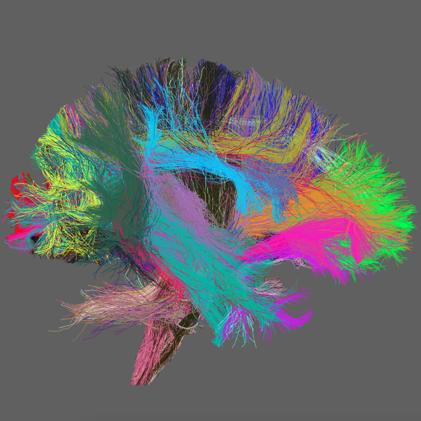

# app-wmaSeg
Automatically segment a tractogram into major white matter tracts.

### Authors
- Daniel Bullock (dnbulloc@iu.edu)

### Contributors
- Soichi Hayashi (hayashis@iu.edu)
- Franco Pestilli (franpest@indiana.edu)

### Project Director
- Franco Pestilli (franpest@indiana.edu)

### Funding 

### References 
TBA

## Running the App 

### On Brainlife.io

Visit https://doi.org/10.25663/brainlife.app.188 to run this app on the brainlife.io platform.  Requires a freesurfer input (as it makes use of the 2009 parcellation) and an input tractography.

### Running Locally (on your machine) using singularity & docker

Because this is compiled code which runs on singularity, you can download the repo and run it locally with minimal setup.  Ensure that you have singularity and freesurfer set up locally (freesurfer setup not necessary if relevant parcellation files have already been converted to nii.gz).

### Running Locally (on your machine)

Pull the wma toolkit repo:  https://github.com/DanNBullock/wma_tools

Ensure that vistasoft (https://github.com/vistalab/vistasoft)and spm (https://www.fil.ion.ucl.ac.uk/spm/software/ ; tested with spm8) are installed.

Run: https://github.com/DanNBullock/wma_tools/blob/master/wma_segMajTracks_BL_v2.m , but take care to ensure that the addpath-genpath statements are relevant to your local setup.

Utilize a config.json setup that is analagous to the one contained within this repo, listed as a sample.

### Sample Datasets

Visit brainlife.io and explore the following data sets to find viable freesurfer and tractography inputs:

03D: https://brainlife.io/pub/5a0f0fad2c214c9ba8624376

HCP freesurfer:  https://brainlife.io/project/5941a225f876b000210c11e5/detail
HCP tractography:  https://brainlife.io/project/5c3caea0a6747b0036dcbf9a/

## Output

The relevant output for this application is a classification structure.  The classification structure is a .mat file which contains a matlab structure (entitled classification) with two fields:  names and index.  The names field lists the names of tracts which were identified by this process as strings.  The index field is a 1 dimensional vector containing zeros for all unidentified streamlines, and integer index values corresponding to streamlines' membership in the corresponding structure of the names vector.

#### Product.json

Not relevant for this App as it does not generate processed data. 

### Dependencies

This App only requires [singularity](https://www.sylabs.io/singularity/) and (in some cases) Freesurfer to run. If you don't have singularity, you will need to install following dependencies.  

https://singularity.lbl.gov/docs-installation
https://surfer.nmr.mgh.harvard.edu/fswiki/DownloadAndInstall
 
